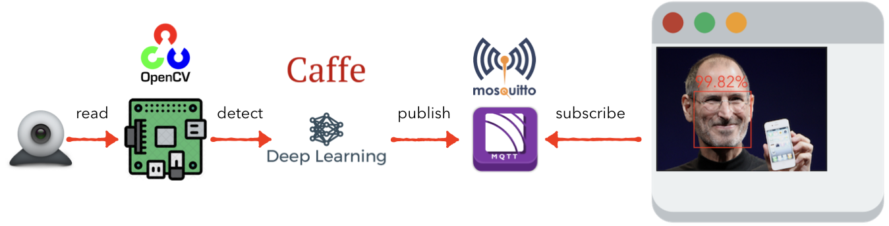

# [Face Detection Enrollment](https://github.com/taka-wang/face_detection_enrollment.git)

Face detector is based on the single shot detector (SSD) framewrok with a ResNet-base deep learning neural network. After retrieving a high quality face image, we save it to the disk and send it to the frontend page.

## Procedure

[Steve Job's Photo: courtesy of Wikipedia](https://en.wikipedia.org/wiki/Steve_Jobs#/media/File:Steve_Jobs_Headshot_2010-CROP.jpg)

1. Get video frames via OpenCV.
1. Face detection via pre-trained caffe-based deep learning model.
1. If the confidence of the video frame is higher than a given threshold, we save the video frame to the disk and send its base64 string to the frontend via MQTT over websocket.

## Run

1. Install OpenCV ([You may refer to this guide](https://www.pyimagesearch.com/2018/05/28/ubuntu-18-04-how-to-install-opencv/))
1. pip install -r [requirements.txt](requirements.txt)
1. python [record.py](record.py)
1. Navigate the web browser to [index.html](app/index.html) in the app folder

## References

- [Caffe-based face detector model](https://github.com/opencv/opencv/blob/master/samples/dnn/face_detector/deploy.prototxt)

- [Caffe weight file](https://github.com/opencv/opencv_3rdparty/tree/dnn_samples_face_detector_20170830)

- [Mean subtraction parameters - Faster-RCNN, ResNet backbone](https://github.com/opencv/opencv/tree/master/samples/dnn)

- [Face detection with OpenCV and deep learning](https://www.pyimagesearch.com/2018/02/26/face-detection-with-opencv-and-deep-learning/)

## Licensing

The project is licensed under the Apache License, Version 2.0. See
[LICENSE](https://github.com/taka-wang/face_detection_enrollment/blob/master/LICENSE) for the full
license text.